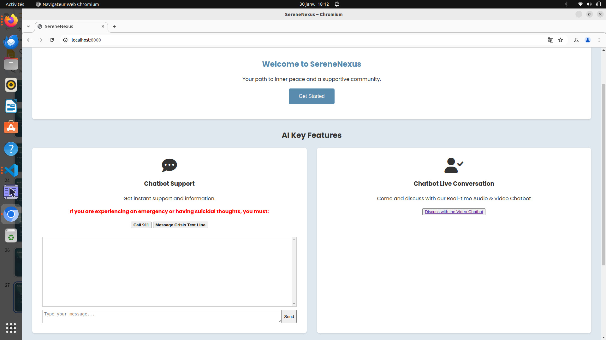
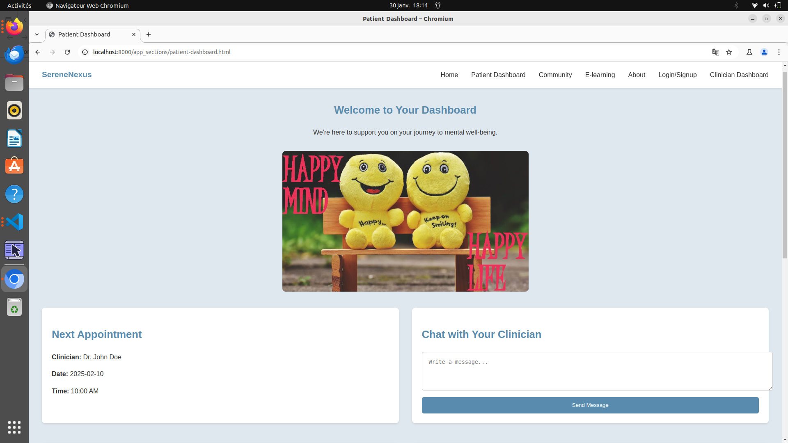
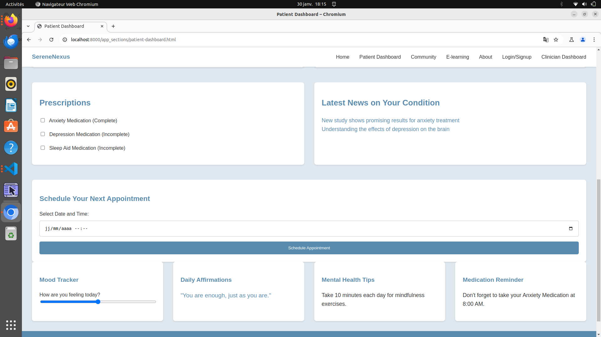
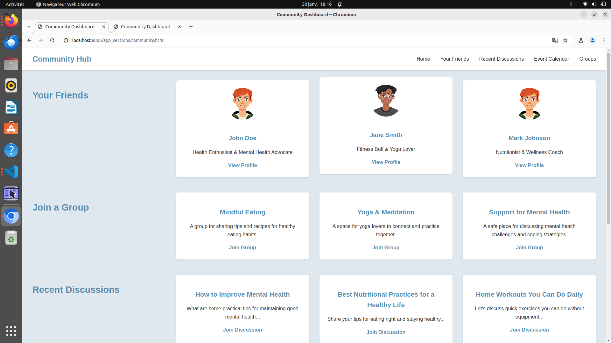
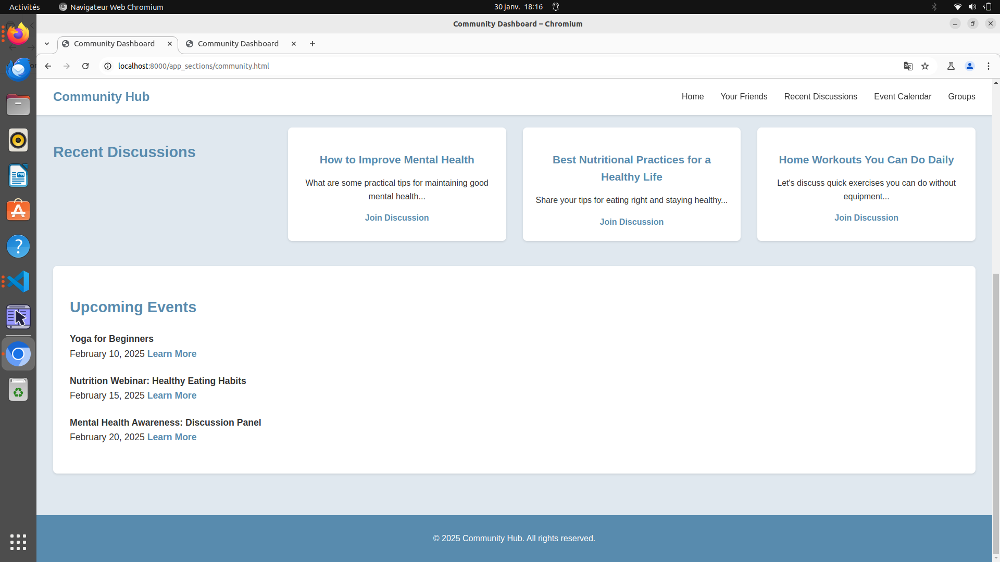
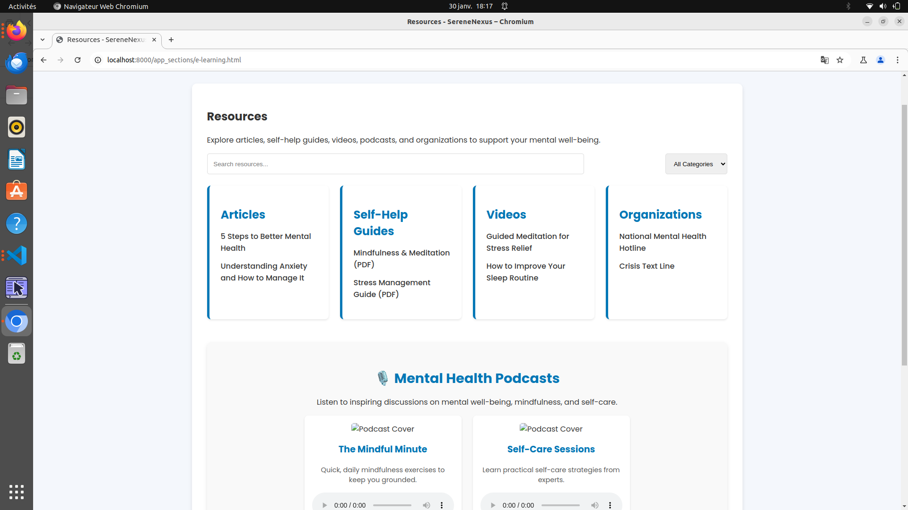
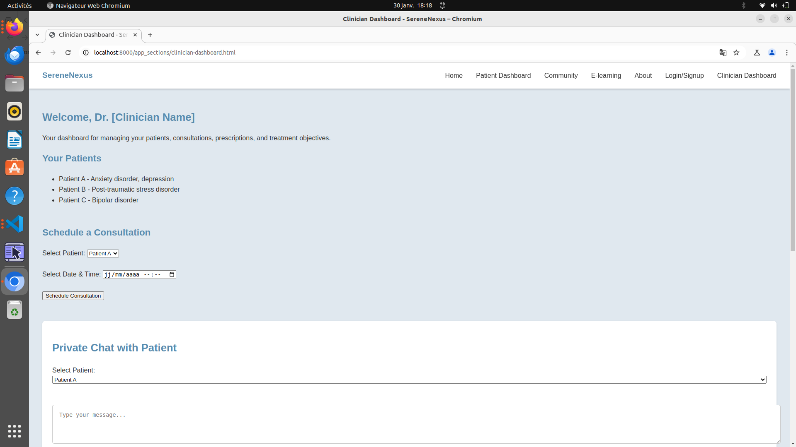
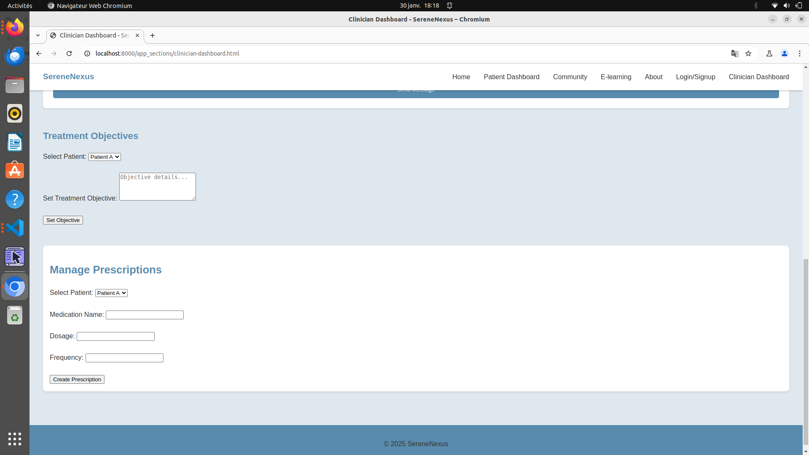

# MEXA-Hackathon-2025

This repository contains the work of the team "Serotonin-Sync" team.

# Description

Mental health challenges are complex, but addressing them doesn’t have to be. This application uses AI to bridge the gap between patients and clinicians, offering an innovative, data-driven approach to diagnosing and managing mental health issues. By incorporating lived experience experts and harnessing the power of Natural Language Processing (NLP) and Computer Vision (CV), we deliver an efficient and innovative solution while prioritizing ethics, privacy, and the responsible use of technology.

# Structure

- The folder "Computer Vision" contains everything related to trainin and running deep learning which could analyze the facial emotion on photos and videos.
- The folder "LLMs" contains all the code related to the development of chatbots in the platform
- THe folder "app_sections" contains all the main menu section of the platform

# How to run our code

 Here are some packages required in order to run our code:
 >> pip install google-genai==0.3.0 websockets 

In order to run our platform:
- Create a conda terminal and run: 
    >> python Chatbots/video_chatbot/video_chatbot.py
- Create another terminal and run: 
    >> python -m http.server (This load the web platform)

- Now go on a google chrome webpage and search the following adress: localhost/8000

To see the training code of our AI-computer vision model, go to : "Computer VIsion/EmoXNet/model_training.ipynb"
To see an inference example of AI-computer vision model, go to : "Computer VIsion/EmoXNet/model_inference.ipynb"

# Visual aspect 

